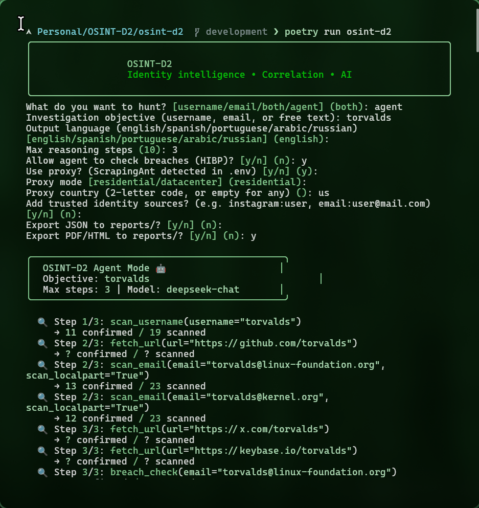

<p align="center">
  
</p>

<h1 align="center">OSINT-D2</h1>

<p align="center">
  <strong>Agentic OSINT • Identity Intelligence • Cognitive Profiling</strong>
</p>

<p align="center">
  <a href="#installation"></a>
  <a href="#installation"></a>
  <a href="#ai-analysis--language"></a>
  <a href="#-agent-mode--agentic-ai"></a>
  <a href="https://scrapingant.com/?ref=osint-d2"></a>
  <a href="LICENSE"></a>
</p>

---

OSINT-D2 is an **advanced open-source intelligence platform** that transforms usernames and emails into structured identity dossiers. Powered by **agentic AI** and backed by [**ScrapingAnt**](https://scrapingant.com/?ref=osint-d2)'s enterprise-grade proxy infrastructure, it delivers intelligence-grade identity correlation, cognitive profiling, and breach analysis — all from a single CLI command.

## Why OSINT-D2?

| Capability | What it does |
|---|---|
| 🔍 **Multi-source correlation** | Links usernames, emails, and derived aliases across 30+ platforms in a single run |
| 🤖 **Agentic AI** | Autonomous investigation — the LLM decides which tools to invoke and pivots across identities automatically |
| 🧠 **6-dimension cognitive profiling** | Identity, Geo-temporal, OCEAN psychology, Technical stack, Ideology, and OpSec analysis |
| 🛡️ **Trust anchors** | Define verified identity sources to filter false positives and focus on real targets |
| 🌐 **ScrapingAnt proxy integration** | Residential & datacenter proxies to bypass rate limits and anti-bot blocks worldwide |
| 📊 **Premium PDF dossiers** | Classified-style reports with identity cards, OCEAN profiles, OpSec risk matrices, and rendered Markdown |
| 💀 **Breach exposure (HIBP)** | Query HaveIBeenPwned to find data breaches linked to discovered emails |
| 🌍 **5 languages** | English, Spanish, Portuguese, Arabic, and Russian — CLI, wizard, AI, and reports |
| 📦 **Cross-platform binaries** | Ship standalone executables via PyInstaller for Linux, macOS, and Windows |

---

## Table of Contents

- [Quick Start](#quick-start)
- [Installation](#installation)
- [Proxy: Powered by ScrapingAnt](#-proxy-powered-by-scrapingant)
- [Command Reference](#command-reference)
- [Agent Mode (Agentic AI)](#-agent-mode--agentic-ai)
- [Trust Anchors](#-trust-anchors)
- [AI Analysis & Language](#ai-analysis--language)
- [Premium PDF Dossiers](#-premium-pdf-dossiers)
- [Breach Checking (HIBP)](#-breach-checking-hibp)
- [Interactive Wizard](#-interactive-wizard)
- [Architecture](#architecture)
- [Packaging (PyInstaller)](#packaging-pyinstaller)
- [Troubleshooting](#troubleshooting)
- [Disclaimer](#disclaimer)

---

## Quick Start

```bash
# Clone and install
git clone https://github.com/Doble-2/osint-d2.git && cd osint-d2
poetry install

# Configure AI (interactive — no manual editing)
poetry run osint-d2 doctor setup-ai

# Launch the interactive wizard
poetry run osint-d2

# Or go straight to agent mode
poetry run osint-d2 agent "target-username" --export-pdf --export-json
```


---

## Installation

### Prerequisites

- **Python 3.11** or newer
- **Poetry** (dependency manager)
- System libraries for PDF generation (WeasyPrint)

### 1. System dependencies (PDF export)

PDF dossiers are rendered via WeasyPrint, which requires native libraries:

<details>
<summary><strong>macOS (Homebrew)</strong></summary>

```bash
brew install cairo pango gdk-pixbuf libffi
```
</details>

<details>
<summary><strong>Ubuntu / Debian</strong></summary>

```bash
sudo apt-get update
sudo apt-get install -y \
  libcairo2 libpango-1.0-0 libpangoft2-1.0-0 \
  libgdk-pixbuf2.0-0 libffi-dev shared-mime-info
```
</details>

<details>
<summary><strong>Fedora</strong></summary>

```bash
sudo dnf install -y cairo pango gdk-pixbuf2 libffi shared-mime-info
```
</details>

<details>
<summary><strong>Arch</strong></summary>

```bash
sudo pacman -S --needed cairo pango gdk-pixbuf2 libffi shared-mime-info
```
</details>

### 2. Install OSINT-D2

```bash
git clone https://github.com/Doble-2/osint-d2.git
cd osint-d2
poetry install
```

### 3. Configure environment

```bash
cp .env.example .env
```

Edit `.env` with your keys (or use the interactive setup):

```bash
poetry run osint-d2 doctor setup-ai    # AI key (interactive)
poetry run osint-d2 doctor run         # Validate everything
```

### Environment variables

| Variable | Required | Description |
|---|---|---|
| `OSINT_D2_AI_API_KEY` | For AI | API key for DeepSeek, Groq, OpenRouter, or any OpenAI-compatible provider |
| `OSINT_D2_AI_BASE_URL` | No | Custom API endpoint (auto-detected from provider preset) |
| `OSINT_D2_AI_MODEL` | No | Model name override (default: `deepseek-chat`) |
| `OSINT_D2_AI_TIMEOUT_SECONDS` | No | API timeout (default: 120) |
| `OSINT_D2_PROXY_API_KEY` | For proxy | ScrapingAnt API key |
| `OSINT_D2_PROXY_MODE` | No | `residential` or `datacenter` (default: `residential`) |
| `OSINT_D2_PROXY_COUNTRY` | No | 2-letter country code for geo-targeted proxy |
| `OSINT_D2_DEFAULT_LANGUAGE` | No | Default language: `en`, `es`, `pt`, `ar`, `ru` |

---

## 🌐 Proxy: Powered by ScrapingAnt

<p align="center">
  <a href="https://scrapingant.com/?ref=osint-d2">
    
  </a>
</p>

OSINT-D2's web scraping capabilities are powered by [**ScrapingAnt**](https://scrapingant.com/?ref=osint-d2) — an enterprise-grade proxy and web scraping platform trusted by thousands of developers worldwide.

### Why ScrapingAnt?

| Feature | Benefit for OSINT-D2 |
|---|---|
| 🏠 **Residential proxies** | Access social platforms like Instagram, X/Twitter, and LinkedIn that block datacenter IPs |
| 🌍 **190+ countries** | Geo-targeted requests to see region-specific content |
| ♻️ **Automatic rotation** | Fresh IPs on every request — no bans, no CAPTCHAs |
| 🛡️ **Anti-bot bypass** | Built-in JavaScript rendering and browser fingerprint rotation |
| ⚡ **99.9% uptime** | Enterprise reliability for production OSINT workflows |
| 💰 **Free tier available** | Start investigating immediately — upgrade when you scale |

### Setup

```bash
# Add to your .env
OSINT_D2_PROXY_API_KEY=your-scrapingant-api-key

# Optional configuration
OSINT_D2_PROXY_MODE=residential    # or 'datacenter'
OSINT_D2_PROXY_COUNTRY=us          # 2-letter country code
```

When configured, **all HTTP requests are automatically routed through ScrapingAnt** — no code changes needed. The proxy status is visible in the doctor diagnostics:

```bash
osint-d2 doctor run

# Output:
# ┌───────────────┬────────┬───────────────────────┐
# │ Proxy mode    │ OK     │ residential (ScrapingAnt) │
# │ Proxy API key │ OK     │ ****14c8              │
# │ Proxy country │ OK     │ us                    │
# └───────────────┴────────┴───────────────────────┘
```

### Per-run overrides

```bash
# Force datacenter proxy for Germany
osint-d2 hunt -u torvalds --proxy datacenter --proxy-country de

# Disable proxy for this run
osint-d2 agent "torvalds" --no-proxy

# Use residential US proxy with agent mode
osint-d2 agent "target" --proxy residential --proxy-country us
```

> 💡 **Get your ScrapingAnt API key** → [scrapingant.com](https://scrapingant.com/?ref=osint-d2)

---

## Command Reference

| Command | Description |
|---|---|
| `wizard` | 🧙 Interactive guided workflow — choose mode, sources, language, trust anchors, and exports step by step |
| `scan` | ⚡ Lightweight username sweep across 18+ built-in social networks |
| `scan-email` | 📧 Email-centric scan with optional local-part username pivot |
| `hunt` | 🎯 Full pipeline: usernames + emails + Sherlock + site-lists + AI + PDF |
| `agent` | 🤖 **Autonomous AI investigation** — the LLM decides everything |
| `analyze` | 🔄 Re-run AI analysis on a previously exported JSON dossier |
| `doctor` | 🩺 Environment diagnostics, AI setup wizard, connectivity checks |

### Key flags

| Flag | Available in | Description |
|---|---|---|
| `--site-lists / --no-site-lists` | `hunt`, `wizard` | Enable WhatsMyName-style data-driven site manifests |
| `--sherlock / --no-sherlock` | `hunt`, `wizard` | Download and execute the Sherlock manifest (~400 sites) |
| `--strict / --no-strict` | `hunt`, `wizard` | Apply defensive heuristics to reduce false positives |
| `--export-json` | `hunt`, `agent`, `wizard` | Write JSON dossier to `reports/` |
| `--export-pdf` | `hunt`, `agent`, `wizard` | Write PDF/HTML dossier to `reports/` |
| `--format json` | `hunt`, `scan`, `scan-email` | Machine-readable JSON output for automation |
| `-l, --language` | All | `en`, `es`, `pt`, `ar`, `ru` — affects CLI, AI, and reports |
| `--breach-check` | `hunt`, `agent` | Enable HaveIBeenPwned breach queries |
| `--trust` | `hunt`, `agent` | Define trusted identity sources (repeatable) |
| `--proxy` / `--no-proxy` | All | Override or disable ScrapingAnt proxy |

### Usage examples

```bash
# Full hunt: usernames + email + Sherlock + site lists + PDF dossier
osint-d2 hunt \
  --usernames exampleuser \
  --emails user@example.com \
  --site-lists \
  --sherlock \
  --strict \
  --export-pdf

# Quick email triage without AI
osint-d2 scan-email user@example.com --no-deep-analyze

# Re-run AI profiler on an exported dossier in Spanish
osint-d2 analyze reports/example.json --language es

# Autonomous agent with breach checking + exports
osint-d2 agent "doble-2" --breach-check --export-json --export-pdf -l es
```


---

## 🤖 Agent Mode — Agentic AI

Agent mode is where OSINT-D2 truly shines. Instead of manually specifying what to scan, **the AI decides everything autonomously**: which usernames to scan, which emails to investigate, which URLs to fetch, and when to pivot to new leads.

```
osint-d2 agent "doble-2" -l es --max-steps 10

╭─────────────────────────────────────────────╮
│  OSINT-D2 Agent Mode 🤖                    │
│  Objective: doble-2                         │
│  Max steps: 10 | Model: deepseek-chat       │
╰─────────────────────────────────────────────╯

  🔍 Step 1/10: scan_username(username="doble-2")
     → 10 confirmed / 30 scanned
  🔍 Step 1/10: scan_username(username="angelcalderon.dev")
     → 4 confirmed / 19 scanned
  🔍 Step 2/10: fetch_url(url="https://angelcalderon.dev")
     → extracted emails, social links, phone numbers
  🔍 Step 3/10: scan_email(email="hola@angelcalderon.dev")
     → 14 confirmed / 23 scanned
  🔍 Step 3/10: breach_check(email="hola@angelcalderon.dev")
     → 0 breaches found ✅
  🔍 Step 4/10: scan_username(username="doblevneko")
     → 2 confirmed / 19 scanned
  📋 Step 8/10: generate_report(confidence=0.92)

  🛡️ Trust anchors discarded 26 false positive(s)
  ✓ Agent concluded in 16 tool calls. Confidence: 92%
```

### Agent tools

The agent has access to 5 tools that it orchestrates autonomously:

| Tool | Description |
|---|---|
| `scan_username` | Scan 18+ social networks for a username (GitHub, X, Instagram, Twitch, Telegram, etc.) |
| `scan_email` | Scan Gravatar, PGP keyservers + pivot the local-part as a username |
| `fetch_url` | Scrape any URL and extract social links, emails, phone numbers, and metadata |
| `breach_check` | Query HaveIBeenPwned for data breaches (requires `--breach-check`) |
| `generate_report` | Submit the final 6-dimension intelligence report (ends investigation) |

### How it works

```
┌──────────────┐     ┌──────────────────┐     ┌───────────────┐
│  User gives  │────▶│  LLM receives    │────▶│  LLM calls    │
│  objective   │     │  objective +     │     │  tools via    │
│  "doble-2"   │     │  available tools │     │  function     │
│              │     │                  │     │  calling      │
└──────────────┘     └──────────────────┘     └───────┬───────┘
                                                      │
                     ┌──────────────────┐             │
                     │  LLM analyzes    │◀────────────┘
                     │  results and     │
                     │  decides next    │──── pivots to new usernames,
                     │  action          │     emails, URLs discovered
                     └───────┬──────────┘
                             │
                     ┌───────▼──────────┐
                     │  generate_report │
                     │  6-dimension     │
                     │  intelligence    │
                     │  dossier         │
                     └──────────────────┘
```

1. You provide an **objective** (username, email, or free text)
2. The LLM receives the objective + available tools
3. The LLM calls tools (e.g., `scan_username("doble-2")`) and receives structured results
4. Based on findings, the LLM **pivots** — discovers new aliases, emails, and linked profiles
5. When enough evidence is gathered, the LLM generates a **structured 6-dimension cognitive profile**

### Agent examples

```bash
# Quick investigation (default 10 steps)
osint-d2 agent "torvalds"

# Spanish output, 10 steps, with breach checking + exports
osint-d2 agent "doble-2" -l es --max-steps 10 --breach-check --export-pdf --export-json

# With trusted sources to filter false positives
osint-d2 agent "xkissmely" \
  --trust instagram:xkissmely \
  --trust email:kissmelymarcano@gmail.com \
  -l es

# Using Groq as AI provider
osint-d2 agent "target" --ai-provider groq --max-steps 8
```

The wizard also supports agent mode — select `"agent"` when prompted for hunt type.

---

## 🛡️ Trust Anchors

Trust anchors let you define **verified sources of truth** for an identity. When active, OSINT-D2 uses these anchors to **automatically discard false positives** — profiles on other networks that don't match the verified identity.

### How it works

If you know that `xkissmely` is the real Instagram handle, you can tell OSINT-D2:

```bash
osint-d2 agent "xkissmely" \
  --trust instagram:xkissmely \
  --trust twitter:kissmely13 \
  --trust email:kissmelymarcano@gmail.com
```

OSINT-D2 will:
1. Extract the **real name** from trusted profiles (e.g., from Instagram bio)
2. Compare discovered profiles against the trusted identity
3. **Discard profiles** that belong to a different person (e.g., a Pinterest user named "John Smith" when the target is "Kissmely Marcano")
4. Report how many false positives were filtered: `🛡️ Trust anchors discarded 26 false positive(s)`

### Supported formats

```
instagram:username
github:username
twitter:username
email:user@domain.com
```

In the wizard, you can enter multiple anchors per line (comma or space separated):

```
Trust anchor(s) (): github:doble-2, instagram:angelcalderon.dev
  + github:doble-2
  + instagram:angelcalderon.dev
```

---

## AI Analysis & Language

OSINT-D2 produces structured intelligence reports using **any OpenAI-compatible LLM**. The AI generates a **6-dimension cognitive profile**:

| Dimension | What it covers |
|---|---|
| 🆔 **Identity** | Real name, aliases, emails, phone numbers, demographics |
| 🌍 **Geo-temporal** | Location inference, timezone, activity patterns, sleep schedule |
| 🧠 **Psychological (OCEAN)** | Openness, Conscientiousness, Extraversion, Agreeableness, Neuroticism |
| 💻 **Technical/Professional** | Tech stack, seniority level, professional archetype |
| ⚖️ **Ideology** | Political/ethical leanings, values, cultural affiliations |
| ⚠️ **OpSec** | Attack surface, social engineering susceptibility, exposure risks |

### Supported AI providers

| Preset | Model | Best for |
|---|---|---|
| `deepseek` | `deepseek-chat` | Best quality/cost ratio (recommended) |
| `groq` | `llama-3.1-70b-versatile` | Fast, high quality |
| `groq-fast` | `llama-3.1-8b-instant` | Ultra-fast, lower quality |
| `openrouter` | `openai/gpt-4o-mini` | OpenAI models via OpenRouter |
| `huggingface` | `meta-llama/Llama-3.1-8B-Instruct` | Open-source models |

### Key AI flags

```bash
# scan/scan-email: --deep-analyze / --no-deep-analyze
# hunt: --ai / --noai
# agent: always uses AI

# All commands accept:
--ai-provider deepseek|groq|groq-fast|openrouter|huggingface
--ai-key "your-key"          # prefer doctor setup-ai instead
--ai-save / --no-ai-save     # persist provider config
--json-raw                   # embed raw AI payload in JSON for auditing
```

### Fallback behavior

- If **no AI key** is configured → automatic heuristic summary (no network calls, still useful)
- If AI **rate-limited** (HTTP 429) → automatic heuristic fallback, run still completes
- If AI returns **invalid JSON** → retry up to 3 times, then heuristic fallback

### Languages

Full support for **5 languages** — CLI prompts, wizard, AI analysis, and PDF reports:

```bash
osint-d2 agent "target" -l es    # Spanish
osint-d2 agent "target" -l pt    # Portuguese
osint-d2 agent "target" -l ar    # Arabic
osint-d2 agent "target" -l ru    # Russian
osint-d2 agent "target" -l en    # English (default)
```


---

## 📄 Premium PDF Dossiers

OSINT-D2 generates **classified-style intelligence dossiers** in PDF and HTML format. The reports include:

- **Classified cover page** with target avatar, network badges, and case metadata
- **Executive summary** with confidence meter, stat boxes, and identity card
- **Parsed AI sections** — Identity, Geo-temporal, OCEAN Profile, Tech Stack, Ideology, OpSec — each rendered as formatted Markdown with tables and lists
- **Highlights** as accent-bordered insight cards
- **Confirmed footprint matrix** with network badges and clickable URLs
- **Breach exposure table** with HaveIBeenPwned results
- **Methodology and limitations** appendix

```bash
# Generate PDF + JSON
osint-d2 agent "doble-2" --export-pdf --export-json -l es

# Re-generate PDF from existing JSON
osint-d2 analyze reports/doble-2.json --language es --export-pdf
```

Reports are saved under `reports/` with sanitized filenames.

> PDF rendering requires WeasyPrint system libraries. See [Installation](#installation).


---

## 💀 Breach Checking (HIBP)

OSINT-D2 queries [Have I Been Pwned](https://haveibeenpwned.com/) to find data breaches linked to discovered email addresses.

```bash
# With hunt
osint-d2 hunt -e user@example.com --breach-check --export-pdf

# With agent (agent discovers emails automatically)
osint-d2 agent "target" --breach-check
```

Results appear in:
- **CLI table**: breach names, domains, dates, record counts, exposed data classes
- **PDF dossier**: dedicated breach section with formatted tables
- **JSON export**: full breach data under each profile entry

---

## 🧙 Interactive Wizard

The wizard guides you through a complete investigation without memorizing flags:

```bash
osint-d2 wizard    # or just: osint-d2
```

The wizard prompts for:

1. **Hunt type**: `username`, `email`, `both`, or `agent`
2. **Target(s)**: one or more usernames/emails
3. **Language**: English, Spanish, Portuguese, Arabic, Russian
4. **Sherlock**: enable/disable the ~400-site Sherlock manifest
5. **Site lists**: enable/disable WhatsMyName-style data-driven lists
6. **Agent mode**: max steps, breach checking
7. **Proxy**: enable/disable ScrapingAnt, mode, and country
8. **Trust anchors**: define verified identity sources
9. **Exports**: JSON and/or PDF to `reports/`

All features available via CLI flags are also accessible through the wizard.

---

## Architecture

```
src/
├── core/                          # Domain logic (framework-agnostic)
│   ├── domain/
│   │   ├── models.py              # PersonEntity, SocialProfile, AnalysisReport
│   │   └── language.py            # Language enum + i18n
│   ├── services/
│   │   ├── identity_pipeline.py   # Orchestrates scan → correlate → analyze
│   │   ├── agent_engine.py        # Agentic AI loop (function calling)
│   │   ├── agent_tools.py         # Tool definitions for the agent
│   │   └── trust_anchor.py        # Trust anchor filtering logic
│   ├── config.py                  # Pydantic settings (env vars)
│   └── resources/                 # Bundled data (site lists, Sherlock)
│
├── adapters/                      # External integrations
│   ├── ai_analyst.py              # LLM interaction (OpenAI SDK)
│   ├── http_client.py             # Async HTTP with proxy support
│   ├── sherlock_runner.py         # Sherlock manifest executor
│   ├── site_list_scanner.py       # WhatsMyName-style scanner
│   ├── specific_scrapers.py       # GitHub, GitLab, Twitch, etc.
│   ├── report_exporter.py         # PDF/HTML/JSON export
│   ├── osint_sources/             # Per-network adapters
│   └── templates/
│       └── report.html            # Jinja2 PDF template
│
└── cli/                           # User interface
    ├── main.py                    # Typer commands + wizard
    └── doctor.py                  # Diagnostics + AI setup
```

The CLI delegates business logic to the service layer, keeping commands thin and testable. Async operations use `asyncio.run()` for Typer compatibility. The architecture follows **hexagonal/ports-and-adapters** design — core logic has zero dependencies on CLI or HTTP libraries.

---

## Packaging (PyInstaller)

Ship OSINT-D2 as a **standalone executable** — no Python required for end users.

<details>
<summary><strong>Linux build</strong></summary>

```bash
python -m venv .venv-build && source .venv-build/bin/activate
pip install -U pip && pip install -e .
bash scripts/build_pyinstaller_linux.sh
```
</details>

<details>
<summary><strong>macOS build</strong></summary>

```bash
python -m venv .venv-build && source .venv-build/bin/activate
pip install -U pip && pip install -e .
bash scripts/build_pyinstaller_macos.sh
```
</details>

<details>
<summary><strong>Windows build (PowerShell)</strong></summary>

```powershell
python -m venv .venv-build
.\.venv-build\Scripts\Activate.ps1
pip install -U pip && pip install -e .
.\scripts\build_pyinstaller_windows.ps1
```
</details>

**Output**: `dist/osint-d2/` — ship this folder as a `.zip` or `.tar.gz`.

### First-run setup for end users

```bash
./osint-d2 doctor setup-ai              # Configure AI key (interactive)
./osint-d2 doctor run                    # Verify environment
./osint-d2 agent "target" --export-pdf   # Start investigating
```

### GitHub Releases

This repo includes a **GitHub Actions workflow** that builds PyInstaller bundles for Linux, macOS, and Windows automatically. Push a version tag to publish:

```bash
git tag v0.1.0
git push origin v0.1.0
```

---

## Troubleshooting

| Issue | Solution |
|---|---|
| `WeasyPrint could not import...` | Install system libs: `brew install cairo pango gdk-pixbuf libffi` (see [Installation](#installation)) |
| AI returns heuristic instead of full analysis | Check API key: `osint-d2 doctor run`. May also be rate limiting — wait 30s and retry |
| `RateLimitError` / HTTP 429 | OSINT-D2 auto-falls back to heuristic. Wait 30-90s or use a different provider |
| Instagram shows "blocked" | Enable ScrapingAnt residential proxy: `--proxy residential --proxy-country us` |
| `Aborted` when piping output | Use `--format json` and redirect to a file instead of piping Rich tables |
| PDF is empty/malformed | Run `osint-d2 doctor run` to verify WeasyPrint status |

### Diagnostics

```bash
osint-d2 doctor run        # Full environment check
osint-d2 doctor setup-ai   # Reconfigure AI provider
```

---

## Disclaimer

OSINT-D2 is intended for **lawful defensive and investigative use**: incident response, fraud detection, brand protection, competitive intelligence, and personal security audits.

- ❌ Do **not** use this tool for harassment, doxxing, stalking, or unauthorized intrusion
- ⚠️ Correlation workflows can produce false positives — always verify with additional evidence
- ⚠️ AI-generated content can be biased or incorrect — treat it as hypothesis generation, not fact
- ✅ Respect privacy, terms of service, and local regulations at all times

---

<p align="center">
  <strong>Built with ❤️ by <a href="https://github.com/Doble-2">Doble-2</a></strong>
  <br />
  Proxy infrastructure powered by <a href="https://scrapingant.com/?ref=osint-d2"><strong>ScrapingAnt</strong></a>
</p>

<p align="center">
  Released under the <a href="LICENSE">MIT License</a>
</p>
