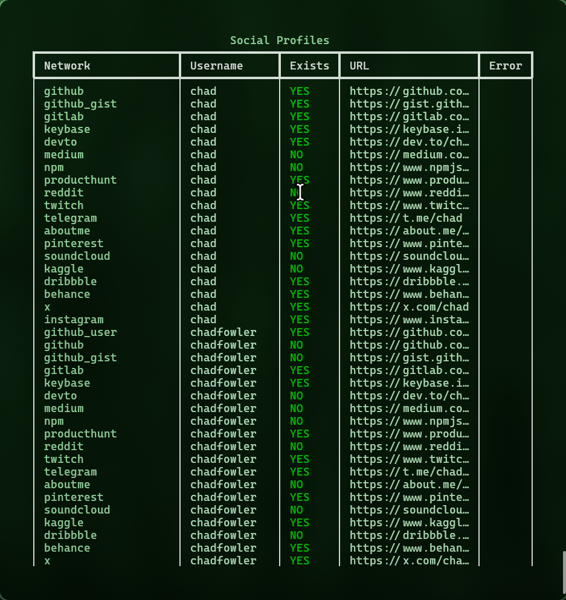
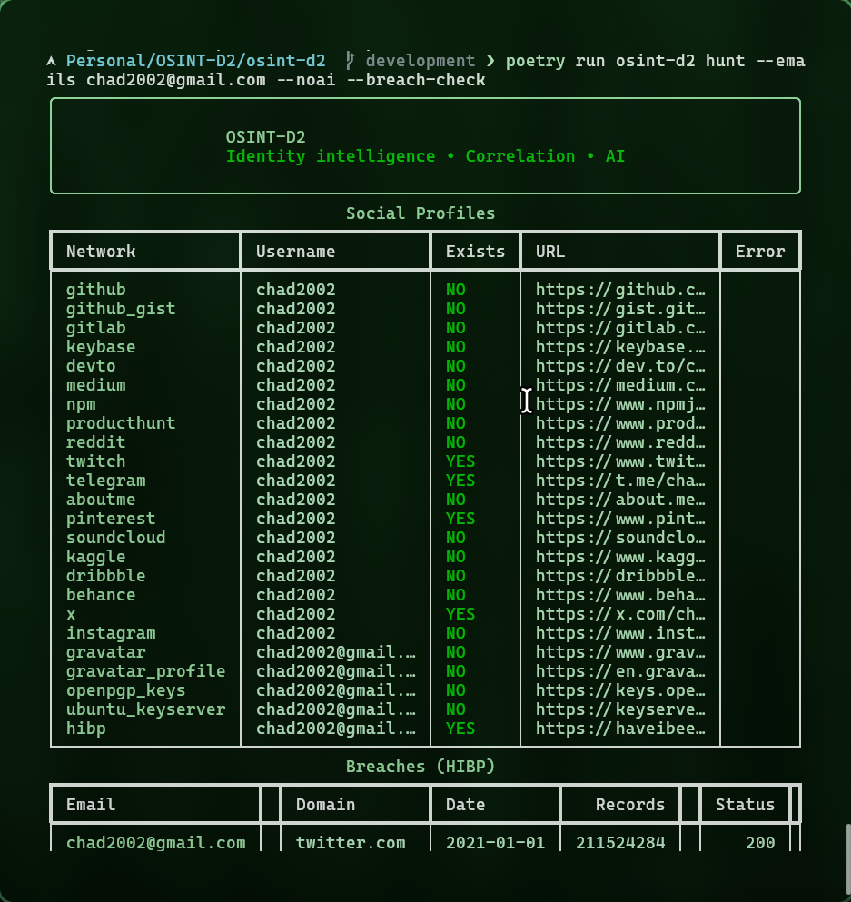
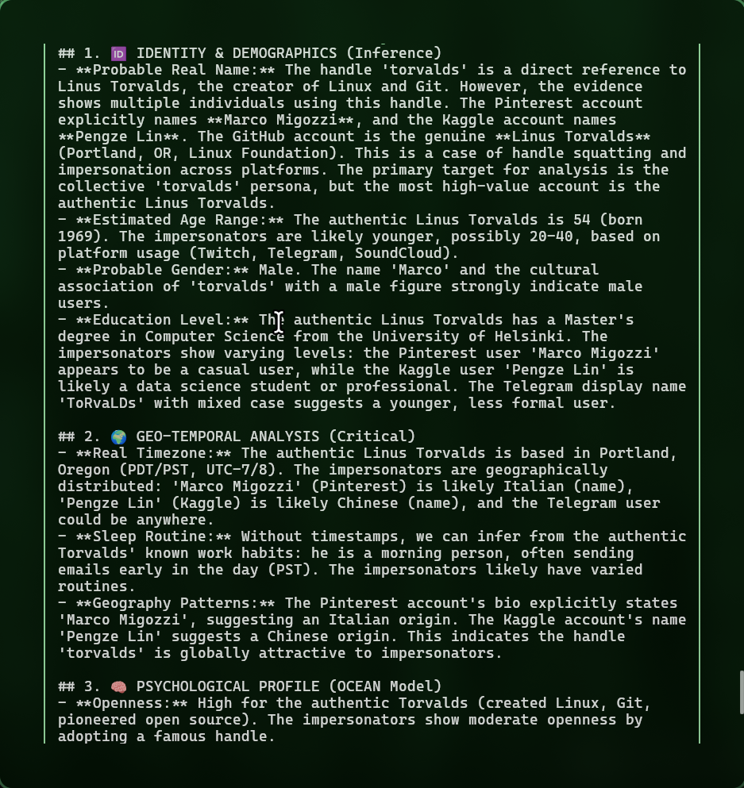
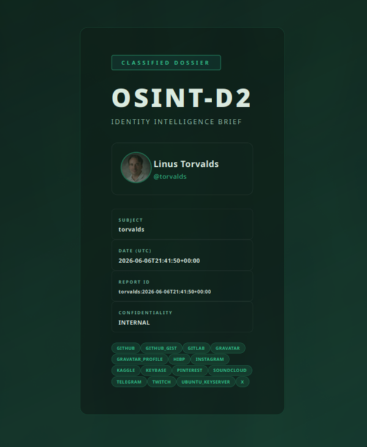

# OSINT-D2

[](#installation)
[](#installation)
[-111827?logo=openai&logoColor=white)](#ai-and-language)
[](#agent-mode)
[](https://scrapingant.com/?ref=osint-d2)
[](LICENSE)

```text
   ____  ____ ___ _   _ _____     ____  ____
  / __ \/ __ `__ \ | | |_   _|   / __ \/ __ \
 / / / / / / / / / | | | | |    / / / / / / /
/ /_/ / /_/ /_/ /| |_| | | |   / /_/ / /_/ /
\____/\__,_|\__,_| \__,_| |_|   \____/\____/
```

**Advanced identity correlation and cognitive profiling CLI**

OSINT-D2 ingests usernames and/or emails, aggregates public evidence from multiple OSINT sources, and enriches the dataset with targeted scrapers. A DeepSeek/OpenAI-compatible analyst can turn the evidence into hypothesis-driven intelligence. The CLI defaults to English while still supporting a full Spanish experience (`--language es`).

## Highlights

- Multi-source correlation that links usernames, emails, and derived aliases in a single run.
- **🤖 Agentic AI mode** — autonomous investigation that pivots across identities using LLM function calling.
- Modular async pipeline with reusable services, Sherlock integration, and support for WhatsMyName-style site lists.
- Cognitive AI analysis (`--deep-analyze`) generating structured summaries, highlights, and confidence levels.
- Professional dossier exports (JSON + PDF/HTML) suitable for incident response or executive briefings.
- Typer + Rich CLI with contextual help, interactive wizard, and JSON-first automation outputs.



## Installation

**Prerequisites**

- Python 3.11 or newer
- Poetry
- WeasyPrint system dependencies (for PDF generation)

### WeasyPrint dependencies

PDF export uses WeasyPrint and requires system libraries.

#### macOS (Homebrew)

```bash
brew install cairo pango gdk-pixbuf libffi
```

#### Ubuntu / Debian

```bash
sudo apt-get update
sudo apt-get install -y \
  libcairo2 libpango-1.0-0 libpangoft2-1.0-0 \
  libgdk-pixbuf2.0-0 libffi-dev shared-mime-info
```

#### Fedora

```bash
sudo dnf install -y cairo pango gdk-pixbuf2 libffi shared-mime-info
```

#### Arch

```bash
sudo pacman -S --needed cairo pango gdk-pixbuf2 libffi shared-mime-info
```

**Setup**

```bash
git clone https://github.com/Doble-2/osint-d2.git
cd osint-d2
poetry install
```

Verify your environment:

```bash
poetry run osint-d2 doctor run
```

Copy `.env.example` to `.env` and configure at least:

- (Optional) `OSINT_D2_AI_API_KEY` (required only if you want remote AI)

Optional overrides:

- `OSINT_D2_AI_BASE_URL`
- `OSINT_D2_AI_MODEL`
- `OSINT_D2_AI_TIMEOUT_SECONDS`
- `OSINT_D2_DEFAULT_LANGUAGE` (`en` or `es`)

### Proxy (ScrapingAnt)

OSINT-D2 natively supports [ScrapingAnt](https://scrapingant.com/?ref=osint-d2) residential and datacenter proxies to bypass rate limits and anti-bot blocks on social platforms.

```bash
# Add to your .env:
OSINT_D2_PROXY_API_KEY=your-scrapingant-api-key
# Optional:
OSINT_D2_PROXY_MODE=residential   # or 'datacenter' (default: residential)
OSINT_D2_PROXY_COUNTRY=us          # 2-letter country code
```

When `OSINT_D2_PROXY_API_KEY` is set, all HTTP requests are automatically routed through ScrapingAnt's rotating proxy network. No code changes needed.

You can also override per-run:

```bash
osint-d2 scan torvalds --proxy datacenter --proxy-country de
osint-d2 hunt -u torvalds --no-proxy   # disable for this run
```

Verify proxy status:

```bash
osint-d2 doctor run
```

AI note:

- Remote AI requires a provider account + API key (even on free tiers).
- If no key is configured, OSINT-D2 automatically falls back to a local heuristic summary (no network calls).

PyInstaller / non-Python users (recommended):

- Run `osint-d2 doctor setup-ai` once and paste your provider key.
- This saves a user config `.env` file (no manual editing).

User config `.env` locations:

- Linux: `~/.config/osint-d2/.env` (or `$XDG_CONFIG_HOME/osint-d2/.env`)
- macOS: `~/Library/Application Support/osint-d2/.env`
- Windows: `%APPDATA%\\osint-d2\\.env`

> PDF exports rely on WeasyPrint 60.1 and pydyf < 0.11 for compatibility.

## Quick Start

Interactive wizard (default command):

```bash
poetry run osint-d2
```

Direct help:

```bash
poetry run osint-d2 --help
poetry run osint-d2 hunt --help
```

Remote AI setup (no manual `.env` editing):

```bash
poetry run osint-d2 doctor setup-ai
```

One-shot preset (prompts for key if missing):

```bash
poetry run osint-d2 scan-email user@example.com --deep-analyze --ai-provider groq
```

Full hunt with AI + breaches:

```bash
poetry run osint-d2 hunt -e user@example.com --ai --ai-provider groq --breach-check --no-ai-save
```



## Command Reference

| Command | Summary |
| --- | --- |
| `wizard` | Guided workflow asking for usernames/emails, language, Sherlock, site-lists, agent mode, and exports. |
| `scan` | Lightweight username sweep across built-in sources. |
| `scan-email` | Email-centric scan with optional local-part username pivot. |
| `hunt` | Full pipeline orchestrating usernames, emails, Sherlock, and site-lists with optional AI. |
| `agent` | **🤖 Autonomous AI investigation** — the LLM decides which tools to use and pivots automatically. |
| `analyze` | Re-run AI analysis against a previously exported JSON dossier. |
| `doctor` | Environment diagnostics (HTTP connectivity, WeasyPrint smoke test, config checks). |

Key flags (apply to the relevant commands):

- `--site-lists / --no-site-lists` enables large data-driven site manifests.
- `--sherlock / --no-sherlock` downloads and executes the Sherlock manifest (~400 sites).
- `--strict / --no-strict` applies defensive heuristics to reduce false positives.
- `--export-json` writes `reports/<target>.json`.
- `--export-pdf` writes `reports/<target>.pdf` (falls back to HTML if PDF fails).
- `--format json` produces machine-friendly output (recommended for automation).
- `-l, --language [es|en|pt]` toggles localized prompts and AI analysis.

AI flags (important):

- `scan` and `scan-email` use `--deep-analyze/--no-deep-analyze`.
- `hunt` uses `--ai/--noai`.
- All of them accept `--ai-provider`, `--ai-save/--no-ai-save`, and `--ai-key`.

Examples:

```bash
# Full hunt: usernames, email, Sherlock, site lists, PDF dossier
poetry run osint-d2 hunt \
  --usernames exampleuser \
  --emails user@example.com \
  --site-lists \
  --sherlock \
  --strict \
  --export-pdf

# Quick email triage with AI analysis disabled
poetry run osint-d2 scan-email user@example.com --no-deep-analyze

# Re-run the AI profiler over an exported dossier in Spanish
poetry run osint-d2 analyze reports/example.json --language es
```

## Agent Mode

**🤖 Agentic AI** lets the LLM autonomously decide which OSINT tools to invoke, analyze results, and pivot to new leads — all without human intervention.

```
osint-d2 agent "torvalds" -l es --max-steps 5

╭─────────────────────────────────────────────╮
│  OSINT-D2 Agent Mode 🤖                    │
│  Objective: torvalds                        │
│  Max steps: 5 | Model: deepseek-chat        │
╰─────────────────────────────────────────────╯

  🔍 Step 1/5: scan_username(username="torvalds")
     → 10 confirmed / 18 scanned
  🔍 Step 2/5: scan_email(email="torvalds@linux-foundation.org")
     → 13 confirmed / 22 scanned
  🔍 Step 3/5: scan_email(email="torvalds@transmeta.com")
     → 11 confirmed / 22 scanned
  📋 Step 4/5: generate_report
     Agent concluded investigation.

  ✓ Agent concluded in 4 steps. Confidence: 0.92
```

The agent has access to these tools:

| Tool | Description |
| --- | --- |
| `scan_username` | Scan 18+ social networks for a username |
| `scan_email` | Scan Gravatar, PGP keyservers + pivot local-part as username |
| `breach_check` | Query HaveIBeenPwned (requires `--breach-check`) |
| `generate_report` | Submit final analysis (ends investigation) |

### Agent examples

```bash
# Quick investigation (default 10 steps)
osint-d2 agent "torvalds"

# Spanish output, 5 steps max
osint-d2 agent "torvalds" -l es --max-steps 5

# With breach checking + exports
osint-d2 agent "user@example.com" --breach-check --export-json --export-pdf

# Using a specific AI provider
osint-d2 agent "doble-2" --ai-provider groq --max-steps 8
```

The wizard also supports agent mode — select "agent" when prompted.

### How it works

1. The user provides an objective (username, email, or free text).
2. The LLM receives the objective + available tools.
3. The LLM calls tools (e.g., `scan_username`) and receives structured results.
4. Based on findings, the LLM decides what to investigate next (pivoting).
5. When enough evidence is gathered, the LLM calls `generate_report` with a structured 6-dimension criminal profile.

The agent respects `--max-steps` to control API credit usage.

## AI and Language

- English is the default CLI and AI language. Use `--language es` (or `OSINT_D2_DEFAULT_LANGUAGE=es`) to switch.

### Providers and presets

Supported presets (examples):

- `--ai-provider deepseek` → `deepseek-chat`
- `--ai-provider groq` / `groq-70b` → `llama-3.1-70b-versatile` (recommended quality)
- `--ai-provider groq-fast` → `llama-3.1-8b-instant` (fast/cheap)
- `--ai-provider openrouter` → `openai/gpt-4o-mini`
- `--ai-provider huggingface` → `meta-llama/Llama-3.1-8B-Instruct`

### Rate limits (TPM) and token usage

Most free tiers rate-limit by **TPM (tokens per minute)** and/or request rate. Token usage roughly is:

$$T_{total} \approx T_{system\_prompt} + T_{evidence} + T_{output}$$

If you hit `RateLimitError`/HTTP 429, OSINT-D2 falls back to a local heuristic summary so your run still completes.

Tips to avoid TPM limits:

- Prefer `--ai-provider groq` for better output quality.
- If you must use small models (like `groq-fast`), OSINT-D2 automatically switches to a **compact prompt** and trims evidence to reduce tokens.
- Wait 30–90 seconds and retry when you get a 429.

### Keys and saving config

AI analysis is optional. When enabled:

- If no `OSINT_D2_AI_API_KEY` is set, OSINT-D2 falls back to a local heuristic summary (no network calls).
- For non-Python / PyInstaller installs, run `osint-d2 doctor setup-ai` and paste the key once.
- Use `--ai-save/--no-ai-save` to control whether provider configuration is persisted.
- `--ai-key` exists but is discouraged because it may end up in shell history; prefer the prompt/wizard.

`--json-raw` embeds the provider payload under `analysis.raw` for auditing.

Treat AI output as hypothesis generation; always confirm with primary evidence.



## Reports

- JSON exports mirror the internal Pydantic models, making them easy to post-process.
- PDF/HTML dossiers are rendered via Jinja2 templates and WeasyPrint, including summary tables and AI narratives when available.
- Exports are written under `reports/` with filenames sanitised via the pipeline helpers.

## Breach checking (HIBP)

OSINT-D2 can query Have I Been Pwned (HIBP) unified search and render results:

- CLI tables: `hunt ... --breach-check`
- Reports: breach results are included in HTML/PDF dossiers when available

Example:

```bash
poetry run osint-d2 hunt -e user@example.com --breach-check --no-sherlock --no-site-lists
```

## Packaging (PyInstaller)

You can ship OSINT-D2 to “simple users” as a standalone executable bundle.

Key design points:

- AI keys are stored in the user config `.env` (no need to edit the project `.env`).
- Runtime datasets (like `sherlock.json`) are stored in a writable user data dir when frozen.
- Report templates are bundled into the executable.

### Linux build (folder distribution)

Build in a clean environment that matches your target distro/glibc:

```bash
python -m venv .venv-build
source .venv-build/bin/activate

pip install -U pip
pip install -e .

bash scripts/build_pyinstaller_linux.sh
```

### macOS build

```bash
python -m venv .venv-build
source .venv-build/bin/activate

pip install -U pip
pip install -e .

bash scripts/build_pyinstaller_macos.sh
```

### Windows build (PowerShell)

```powershell
python -m venv .venv-build
.\.venv-build\Scripts\Activate.ps1

pip install -U pip
pip install -e .

.\scripts\build_pyinstaller_windows.ps1
```

The artifact will be available at:

- `dist/osint-d2/` (ship this folder as a `.zip` or `.tar.gz`)

### First-run setup for end users

Inside the shipped folder:

```bash
./osint-d2 doctor setup-ai
./osint-d2 hunt -e user@example.com --ai --ai-provider groq --breach-check
```

### GitHub Releases (recommended for multiplatform)

This repo includes a GitHub Actions workflow that builds PyInstaller bundles for:

- Linux (`.tar.gz`)
- macOS (`.tar.gz`)
- Windows (`.zip`)

To publish a new release, push a tag like:

```bash
git tag v0.1.0
git push origin v0.1.0
```

The workflow will upload artifacts to the GitHub Release automatically.



## Architecture

- `src/core/` domain models, configuration, resources loader, and orchestrating services (identity pipeline, language utilities).
- `src/adapters/` integrations: HTTP client, Sherlock runner, site lists, AI analyst, exporters, specific scrapers.
- `src/cli/` Typer commands, interactive wizard, doctor utilities, and Rich UI components.

The CLI delegates business logic to the service layer (`core/services/identity_pipeline.py`), keeping commands thin and testable. Async operations are wrapped with `asyncio.run(...)` to stay Typer-friendly.

## Troubleshooting

- `poetry run osint-d2 doctor run` validates AI config presence, HTTP connectivity, and WeasyPrint PDF support.
- Enable `--format json` to capture exact outputs for bug reports or automated pipelines.
- Use `--no-deep-analyze` if you prefer to skip AI calls during debugging.

### "Aborted" when piping output

If you pipe output (e.g. `... | head` / `sed -n ...`) you may see `Aborted.`. This is usually SIGPIPE when the downstream command closes early.

Workarounds:

- Prefer `--format json` and redirect to a file.
- Avoid piping Rich tables when possible.

## Disclaimer

OSINT-D2 is intended for lawful defensive and investigative use (incident response, fraud, brand protection, self-audits). Respect privacy, terms of service, and local regulations.

- Do not use this tool for harassment, doxxing, or unauthorized intrusion.
- Correlation workflows can produce false positives; verify with additional evidence.
- AI-generated content can be biased or incorrect; treat it as guidance rather than fact.

Released under the MIT License. See [LICENSE](LICENSE) for details.
